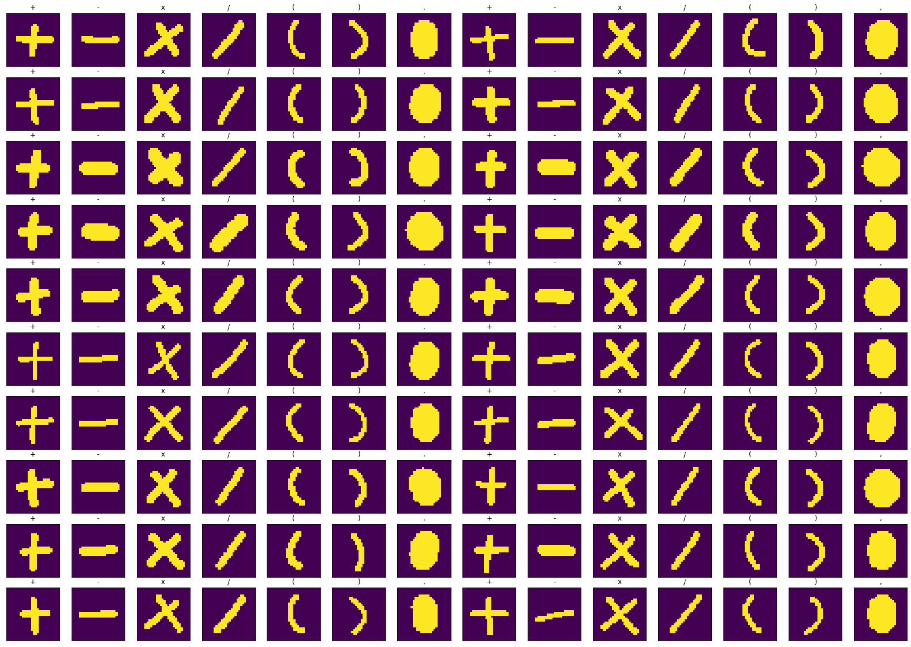

<<<<<<< HEAD
# Handwriting-Calculator
Implement MNIST dataset for handwriting recognition. Apply to calculator app.

<p align="center">
  <br/>
  <i>Handwriting-Calculator</i>
</p>

Fully functioning calculator that take handwritten number as an input. Can do some basic calculation like addition, subtraction, multiplication, and division. Equipped with bracket and comma for decimal value. Follow order of operation in math. 

Handwriting calculator built in top of Handwriting Recognition Neural Network model, train with Keras with 2 hidden layer 20 unit each. Model feed with 70.000 sample number between 0 - 9 MNIST dataset + 49.000 sample of operator symbol `+  -  x  /  (  )  ,` populated manually.

<p align="center">
  <br/>
  <i>Operator dataset</i>
</p>

Actually, i just populate 4.900 sample of operator symbol, then i duplicate each sample ten times without any transformation. Hopely, this will avoid problem cause by imbalance dataset. 
You can improve this model by duplicate it with transformation (rotation / mirror) or continue populate operator symbol until achive 49.000 sample with `add_dataset.py` in src folder. :smile: 

## Setting Environment (optional)
Ignore this step if you dont want to use virtual environment
```
pip install virtualenv
cd Handwriting-Calculator
virtualenv venv
venv\Scripts\activate
```

## Requirements
Install required tools
```
pip install -r requirements.txt
```
**This tools require :**
- [Pillow](https://github.com/python-pillow/Pillow), for grab image from tkinter canvas
- [Numpy](https://github.com/numpy/numpy), for doing image processing as an array
- [TensorFlow](https://github.com/tensorflow/tensorflow), backend for Keras
- [Keras](https://github.com/keras-team/keras), for build and train Neural Network model

## How it works
User draw handwritten number in tkinter canvas and get the image with `PIL.ImageGrab`.
I convert it to `numpy.array`, then apply thresholding to get binary array of each pixel.
Then, using connected component algorithm, we can separate each number on canvas (remember canvas can contain multiple handwriten number/operator).
For each number, resize image to match MNIST dataset sample size, thats 28 by 28 pixel with min padding 4 pixel, by still keeping its aspect ratio. Dont forget to center the number in this image.
The last step, just throw it to `model.predict` to translate what number/operator is it and evaluate the whole calculation.

Note:
I found a problem with `PIL.ImageGrab` when you scale display with other than 100% (on windows, display setting > scale and layout). This mostly occured when you using HD display 1920x1080 or above, you probably scale to 150%.
So, make sure to scale with 100%.


=======
### HANDY-Handwritten Ai Calculator

A Calculator Web App that recognizes handwritten numbers and math symbols and can perform arithmetic and relational operations.

Based on a CNN model that classifies the symbol into 0:9, +, -, x, >, < and neq after extracting it from the input image using image processing techniques.

### Libraries Used:
* [Keras](https://keras.io/) : for building and training a CNN model
* [OpenCV](https://opencv.org/) : for image processing tasks
* [Flask](https://flask.palletsprojects.com/) : for deploying as a web app

### WorkFlow:
- Data acquisition: [Dataset from Kaggle](https://www.kaggle.com/xainano/handwrittenmathsymbols/)
- Data cleaning and processing: cleaned data for required symbols to data_cleaned.rar (extracted) 
- Data Modelling: Built and Trained CNN model using Keras
- Input image pre-processed using OpenCV for basic image processing and to extracted contours to get individual symbols
- Each symbol predicted by giving extracted symbol image as an input to the model
- Mathematical operations are performed on the predictions and output a final result
- Web Application: Used Flask to envelope the model as a web app to provide the user a simple interface
>>>>>>> c113ac4fa971eb7431da41c236e8d2e7d45d8749
